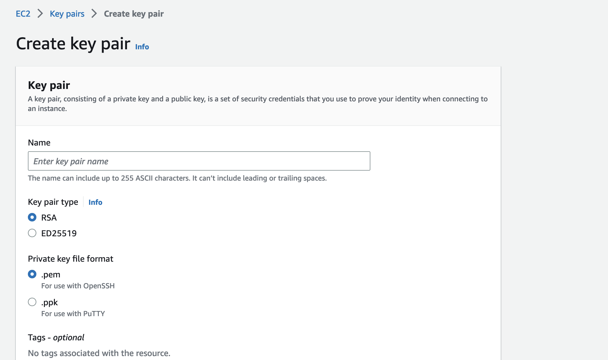
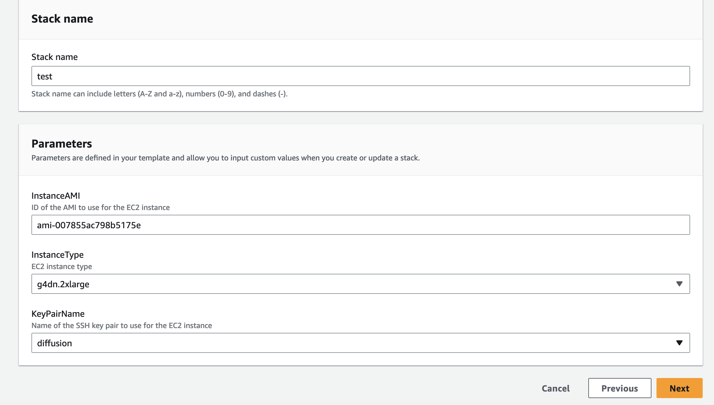
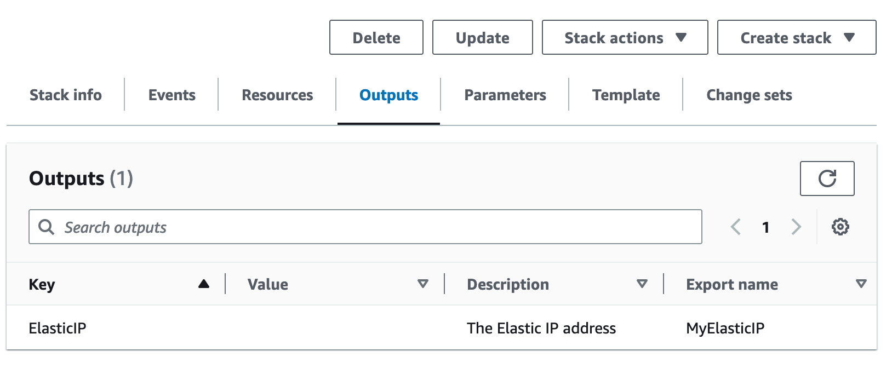

# Stable Diffusion One-Click On AWS

  

**介绍：**

  

通过Cloudformation在aws一键启动AWS G4 EC2实例(英伟达T4)，并使用Python Flask实现Stable Diffusion的Text2Image,Image2Image功能；

  

**项目包含:**

  

* app.py: 基于Flask的Python应用程序，提供了一个简单的Web界面来使用Stable Diffusion模型，将文本转换为图像并进行图像风格迁移。

* lora.py 基于difffuser lib实现了加载safetensors格式模式，灵活使用不同风格的模型

* frontend: 简单的样例界面来展示调用API.

* instance.yaml ：AWS Cloudformation YAML 文件自动提供AWS G4实例并安装Nvida驱动和diffuser相关lib来运行 `app.py`.

  
  

**Cloudformation模版(instance.yaml)功能介绍：**

  
  

* MyVPC：创建一个 VPC，CIDR块设置为`10.0.0.0/16`。为VPC添加一个名为`Name`的标签，值为`My VPC`。

* MyInternetGateway：创建一个Internet网关。为Internet网关添加一个名为`Name`的标签，值为`My IGW`。

* MyVPCGatewayAttachment：将Internet网关附加到VPC。通过`!Ref`引用`MyVPC`和`MyInternetGateway`资源。

* MyPublicSubnet：在VPC中创建一个公共子网，CIDR块设置为`10.0.1.0/24`。为子网添加一个名为`Name`的标签，值为`My Public Subnet`。

* MyRouteTable：为VPC创建一个路由表。为路由表添加一个名为`Name`的标签，值为`My Route Table`。

* MyDefaultRoute：在路由表中创建一个路由，将所有其他未指定的流量（`0.0.0.0/0`）定向到Internet网关。

* MySubnetRouteTableAssociation：将子网与路由表关联。

* MySecurityGroup：创建一个安全组，包含以下入站规则：

* 允许来自任何来源（`0.0.0.0/0`）的TCP流量通过端口22（SSH）。

* 允许来自任何来源（`0.0.0.0/0`）的TCP流量通过端口5000。

* MyInstance：创建一个EC2实例，具有以下属性：

* 实例类型：默认`g4dn.xlarge`，可以按需选择g4dn.2xlarge，g4dn.4xlarge，g4dn.8xlarge，g4dn.12xlarge，g4dn.16xlarge

* 镜像ID：选择 Ubuntu Server 22.04的镜像ID

* 块设备映射：设置`/dev/sda1`设备的EBS卷大小为100GB，类型为`gp3`

* 标签：设置一个名为`Name`的标签，值为stablediffusion-onclick

* 密钥名称：自定义key-pair

* 网络接口：配置网络接口以将安全组和公共子网关联到实例，并分配公共IP地址

* UserData：包含安装运行stable diffusion环境的命令行

* Parameter:设置key pair 和ami id(选择 Ubuntu Server 22.04的镜像)
  

**安装和运行：**

  

* 通过AWS Console创建命EC2 keypair

    

* 通过console界面找到ami id：

    

* 通过AWS Console界面安装和运行项目：

    


* 安装完毕后界面输出访问的IP地址:

    

* 也可以使用以下命令创建一个名为MyStack的新堆栈,通过命令行运行AWS CloudFormation模板，安装和配置AWS CLI，请按照[AWS CLI官方文档](https://docs.aws.amazon.com/cli/latest/userguide/install-cliv2.html)进行安装和配置。：
 

bash

  

```

aws cloudformation create-stack \
  --stack-name my-stack \
  --template-body file://instance.yaml \
  --parameters \
      ParameterKey=InstanceAMI,ParameterValue=your-ami-id \
      ParameterKey=KeyPairName,ParameterValue=my-keypair \
  --capabilities CAPABILITY_IAM


```

  
注意：使用Ubuntu Server 22.04的镜像的ami id和自定义的key pair。

要删除堆栈，请使用`delete-stack`命令：

bash

  

```

aws cloudformation delete-stack --stack-name MyStack

```

  

* 等待15分钟左右，EC2会初始化环境和安装nvida驱动和diffusion lib

* 通过ssh连接EC2,tail -f /var/log/cloud-init-output.log查看安装进度

* 通过ssh连接EC2，运行nvidia-smi,出现nvidia 的系统管理界面
  
    


* 进入Stable-Diffusion-OneClick-AWS，默认已经启动了python3 app.py服务，可以通过sudo systemctl stop myapp.service 停止服务。

* 访问输出的地址http://public_ip/5000，可以看见UI界面
  
    


* 进入Stable-Diffusion-OneClick-AWS，先停止后台服务sudo systemctl start myapp.service；再运行python3 lora.py,会加载lora使用moxin模型生成水墨画风图片
  
    

  

**样例程序说明：**

  

app.py：

为用户提供了两个功能：将文本转换成图像（Text-to-Image）和图像到图像风格迁移（Image-to-Image）

  

* 定义健康检查路由（`/health`）：返回一个字符串`Healthy`和HTTP状态码200，表明应用程序正常运行。

  

```

@app.post("/txt2img")

def text_to_img():

data = request.json

model_id = "stabilityai/stable-diffusion-2"

output = "output_txt2img.png"

  

scheduler = EulerDiscreteScheduler.from_pretrained(model_id, subfolder="scheduler")

pipe = StableDiffusionPipeline.from_pretrained(

model_id, scheduler=scheduler, revision="fp16", torch_dtype=torch.float16

)

pipe = pipe.to("cuda")

image = pipe(data["prompt"], height=data["height"], width=data["width"]).images[0]

  

image.save(output)

return send_file(output), 200

```

  
  

当调用`/txt2img` API时，您需要提供一个JSON对象，其中包含以下参数：

  

* `prompt` (string)：用于生成图像的文本提示。这通常是一个描述性的文本，表示您希望在生成的图像中看到的场景或对象。

* `height` (int)：生成图像的期望高度（以像素为单位)

* `width` (int)：生成图像的期望宽度（以像素为单位）

  

一个典型的JSON输入示例：

  
  

```

{

"prompt": "A beautiful sunset over the ocean",

"height": 512,

"width": 768

}

  

```

  

在这个例子中，文本提示是`A beautiful sunset over the ocean`，期望的图像尺寸为宽度768像素和高度512像素。

您可以使用POST请求调用`/txt2img` API，将JSON对象作为请求正文发送。例如，使用Python `requests`库，您可以这样调用API：

python

  

```

import requestsimport json

  

url = "http://instance ip:5000/txt2img"

data = {

"prompt": "A beautiful sunset over the ocean",

"height": 512,

"width": 768

}

headers = {"Content-Type": "application/json"}

  

response = requests.post(url, data=json.dumps(data), headers=headers)

```

  

请注意，您需要根据实际部署的应用程序URL更新`url`变量。

  
  

* 定义Image-to-Image路由（`/img2img`）：接收JSON数据，其中包含用于风格迁移的文本提示和原始图像的URL。

  

```

@app.post("/img2img")

def img_to_img():

data = request.json

model_id = "runwayml/stable-diffusion-v1-5"

output = "output_img2img.png"

  

pipe = StableDiffusionImg2ImgPipeline.from_pretrained(

model_id, torch_dtype=torch.float16

)

pipe = pipe.to("cuda")

response = requests.get(data["url"])

init_image = Image.open(BytesIO(response.content)).convert("RGB")

init_image = init_image.resize((768, 512))

images = pipe(

prompt=data["prompt"], image=init_image, strength=0.75, guidance_scale=7.5

).images

  

images[0].save(output)

return send_file(output), 200

```

  

当调用`/img2img` API时，您需要提供一个JSON对象，其中包含以下参数：

  

* `prompt` (string)：用于进行图像风格迁移的文本提示。这通常是一个描述性的文本，表示您希望在生成的图像中看到的风格或元素。

* `url` (string)：原始图像的URL。应用程序将从此URL下载图像，并在其基础上应用图像到图像风格迁移。确保提供的URL是一个可访问的图像文件地址。

* 一个典型的JSON输入示例：

  

json

Copy code

  

```

{

"prompt": "Starry night",

"url": "https://example.com/path/to/image.jpg"

}

  

```

  

在这个例子中，文本提示是`Starry night`，表示我们希望将原始图像转换为具有星空般的风格。原始图像的URL是`https://example.com/path/to/image.jpg`。

您可以使用POST请求调用`/img2img` API，将JSON对象作为请求正文发送。例如，使用Python `requests`库，您可以这样调用API：

python

Copy code

  

```

import requestsimport json

  

url = "http://localhost:5000/img2img"

data = {

"prompt": "Starry night",

"url": "https://example.com/path/to/image.jpg"

}

headers = {"Content-Type": "application/json"}

  

response = requests.post(url, data=json.dumps(data), headers=headers)

```

  

请注意，您需要根据实际部署的应用程序URL更新`url`变量。

  
  

**Limit和解决方法：**

  

使用Diffusers包有几个限制，包括:

  

* 无法直接使用safetensors格式模型

* 77提示令牌限制；

* 缺乏LoRA的支持；

* 以及缺少图像放大功能

  
  
  

* **启用FP16**，只需添加两行代码就可以将性能提升500%，而几乎不会影响图像质量

  
  
  

```

`from diffusers import DiffusionPipeline`

`import torch # <----- Line 1 added`

`pipeline = DiffusionPipeline.from_pretrained(`

` r"D:\sd_models\deliberate_v2"`

` ,torch_dtype = torch.float16 # <----- Line 2 Added`

`)`

`pipeline.to("cuda")`

`image = pipeline("A cute cat playing piano").images[0]`

`image.save("image_of_cat_playing_piano.png")`

```

  
  
  

* **Xformers**

  

Xformers是一个开源库，为各种自然语言处理(NLP)任务提供了一组高性能转换器。它建立在PyTorch之上，旨在提供高效且可扩展的转换器模型，可以轻松集成到现有的NLP管道中

  

```

`...`

`pipeline.to("cuda")`

`pipeline.enable_xformers_memory_efficient_attention() <--- one line added`

`...`

```

  

* 移除77个token的限制：

  

通过使用社区提供的“lpw_stable_diffusion”管道，可以解锁77个token限制，生成更长提示词的高质量图片

  
  

```

`pipeline = DiffusionPipeline.from_pretrained(`

` model_path,`

` custom_pipeline="lpw_stable_diffusion", #<--- code added`

` torch_dtype=torch.float16`

`)`

```

  
  
  

* 用diffuser使用lora：可以参考lora.py文件，通过lora.py允许用户实时加载LoRA文件。此功能可用于将LoRA文件及其相应的权重加载到diffusion模型，从而使用LoRA数据生成高质量的图像

  

```

from safetensors.torch import load_file

def __load_lora(

pipeline

,lora_path

,lora_weight=0.5

):

state_dict = load_file(lora_path)

LORA_PREFIX_UNET = 'lora_unet'

LORA_PREFIX_TEXT_ENCODER = 'lora_te'

  

alpha = lora_weight

visited = []

  

# directly update weight in diffusers model

for key in state_dict:

# as we have set the alpha beforehand, so just skip

if '.alpha' in key or key in visited:

continue

if 'text' in key:

layer_infos = key.split('.')[0].split(LORA_PREFIX_TEXT_ENCODER+'_')[-1].split('_')

curr_layer = pipeline.text_encoder

else:

layer_infos = key.split('.')[0].split(LORA_PREFIX_UNET+'_')[-1].split('_')

curr_layer = pipeline.unet

  

# find the target layer

temp_name = layer_infos.pop(0)

while len(layer_infos) > -1:

try:

curr_layer = curr_layer.__getattr__(temp_name)

if len(layer_infos) > 0:

temp_name = layer_infos.pop(0)

elif len(layer_infos) == 0:

break

except Exception:

if len(temp_name) > 0:

temp_name += '_'+layer_infos.pop(0)

else:

temp_name = layer_infos.pop(0)

# org_forward(x) + lora_up(lora_down(x)) * multiplier

pair_keys = []

if 'lora_down' in key:

pair_keys.append(key.replace('lora_down', 'lora_up'))

pair_keys.append(key)

else:

pair_keys.append(key)

pair_keys.append(key.replace('lora_up', 'lora_down'))

# update weight

if len(state_dict[pair_keys[0]].shape) == 4:

weight_up = state_dict[pair_keys[0]].squeeze(3).squeeze(2).to(torch.float32)

weight_down = state_dict[pair_keys[1]].squeeze(3).squeeze(2).to(torch.float32)

curr_layer.weight.data += alpha * torch.mm(weight_up, weight_down).unsqueeze(2).unsqueeze(3)

else:

weight_up = state_dict[pair_keys[0]].to(torch.float32)

weight_down = state_dict[pair_keys[1]].to(torch.float32)

curr_layer.weight.data += alpha * torch.mm(weight_up, weight_down)

# update visited list

for item in pair_keys:

visited.append(item)

return pipeline

```

  
  
  
  

```

@app.post("/txt2img")

def text_to_img():

data = request.json

model_id = "XpucT/Deliberate"

output = "output_txt2img.png"

  

scheduler = EulerDiscreteScheduler.from_pretrained(model_id, subfolder="scheduler")

  
  

pipe = StableDiffusionPipeline.from_pretrained(

model_id,

subfolder="scheduler",

custom_pipeline = "lpw_stable_diffusion" ,

torch_dtype = torch.float16,

)

lora = (r"./moxin.safetensors",0.8)

pipe = __load_lora(pipeline=pipe,lora_path=lora[0],lora_weight=lora[1])

  

pipe = pipe.to("cuda")

#pipe.enable_xformers_memory_efficient_attention()

image = pipe(data["prompt"], height=data["height"], width=data["width"]).images[0]

  

image.save(output)

return send_file(output), 200

```

  

可以通过调用多次 `__load_lora()` 来装载不同的 LoRA模型实现混合模型的模式